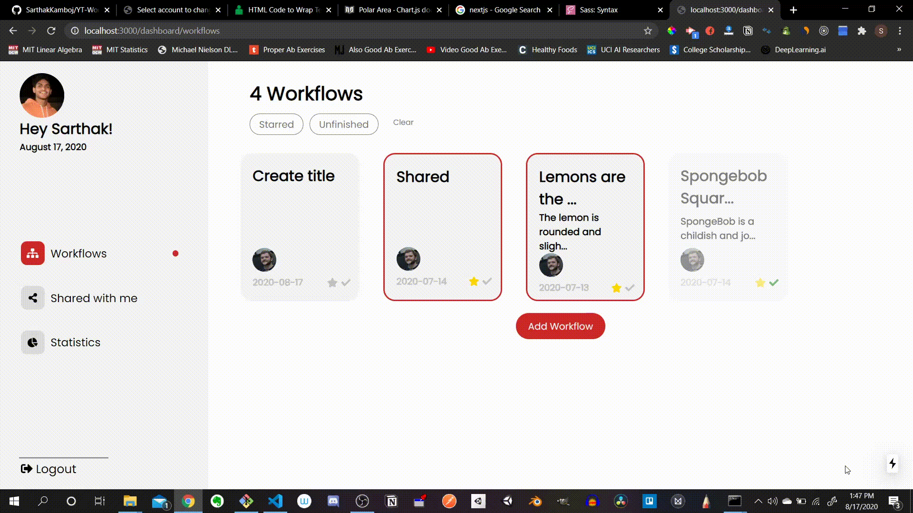
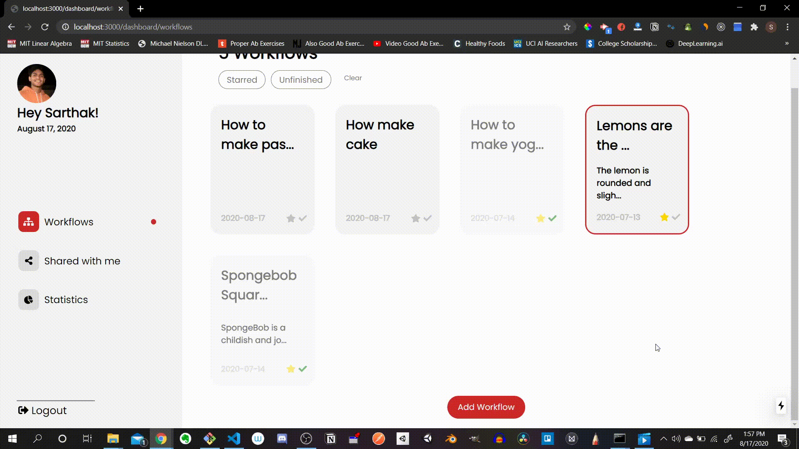

<h2>Intro</h2>

    YouTube is the world's biggest video platform service. However, when making a video, there are many steps to consider before publishing. These include creating an interesting thumbnail, storing videos, writing an intriguing video description, and sometimes even collaborating with others to speed up the video-editing process. YT Workflow is a web application aimed at helping solve these solutions. It is a cloud service that stores videos, images, and text quickly while also allowing users to share their workflows with others. It organizes the entire process by ensuring all contributors to a video can see all media files for a given project at once in real time.

<h2>Features</h2>

    
    <h3>Create Workflow</h3>
    

        Start a new project easily and begin storing video files, image, and text descriptions at the click of a button.
    

    
    <h3>Upload Files</h3>
    

    Add video files and images in any of the categories: Thumbnails, Images, or Videos. These will be stored in the cloud and can be accessed from anywhere.
    

    
    <h3>Title Workflows</h3>  
    

        Give your workflows meaningful titles and organize your projects.
    

<h3>Share with others</h3>

    Give others access to your workflow by sharing it with them, allowing them to edit certain videos and speed up the creative process. They will also be able to upload their own videos, updating the workflow in real time.

<h3>Mark Workflows Important and Finished</h3>

    Update whether or not the workflows have been finished or are more important than others. This can notify you and your peers about whether or not they should spend more time on one project or begin working on another one. 

<h3>View Shared Workflows</h3>

   Work on workflows that have been shared with you by other people. Upload new images, videos, and text descriptions to help finish projects and in a streamlined manner.

<h3>Gain Valuable Insights</h3>

    Visualize patterns in your workflows by analyzing bar graphs, pie charts, and polar area charts. Some of the insights include the number of words in video descriptions, breakdown of media files used, and much more.

<h3>Filter Workflows</h3>

    Filter workflows by whether or not they have been starred or finished. This makes it easy to navigate your workflows and see which projects are in progress and which are important.

<h2>Programming Details</h2>
<h3>Frontend</h3>

    The frontend was developed in JavaScript using the NextJs, a React framework. Moreover, the design and styling of the website was done using the modular version of Sass, a inheritance and function-based form of CSS. This allowed certain styles to impact only one aspect of a webpage, which makes its easy to manage.

<h3>Backend</h3>

    The backend was developed in Python using the Django library. The Django apps were responsible for recording any instances where users share a workflow, storing media files, creating user accounts, and creating workflows. A new Account model overrode the default User model to ensure the unique key identifier was the email of the user and to include information about the user's profile image. A SQLite3 database was used to store all the information and handle updating or deleting data.

<h2>Run the Code</h2>

    Run npm init in the client folder in a command line and pipenv install in the django_backend folder in its own command. Then run "npm run dev" in the client command line to start a server to host the NextJs frontend. Run "pipenv shell" in the backend command line, then run "python manage.py runserver" to start a server to host the Django backend.

