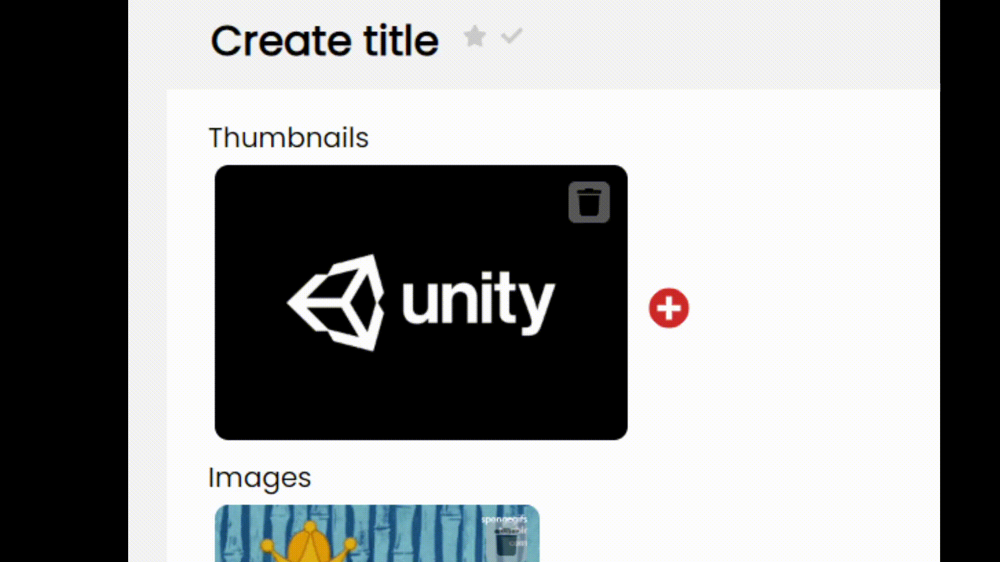
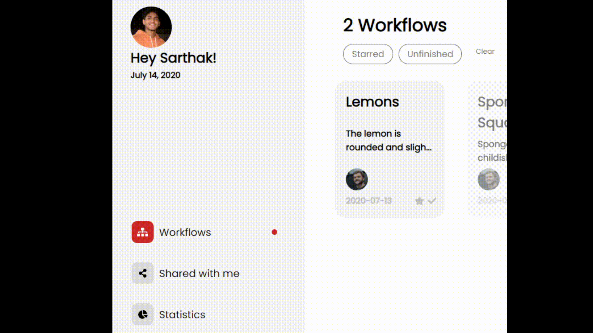
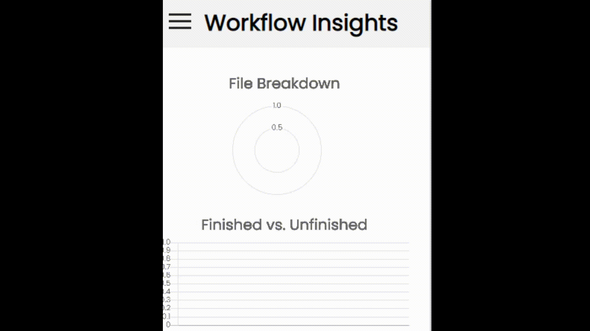
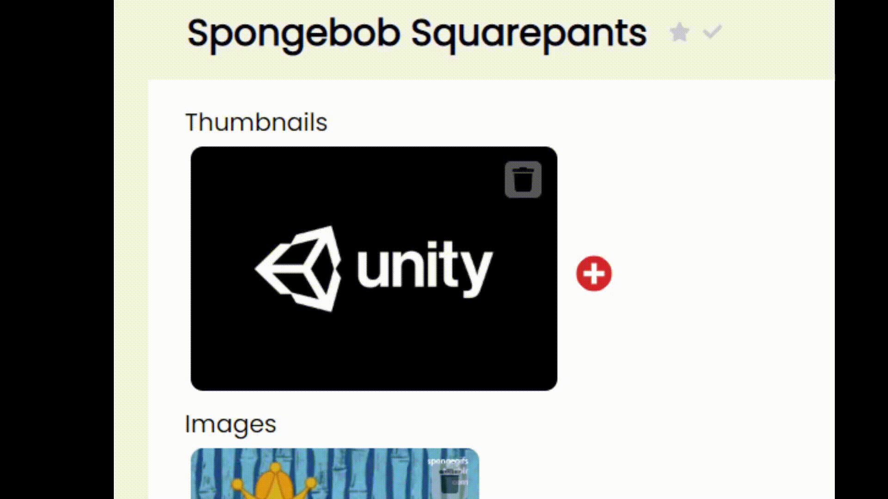

<h2>Intro</h2>

    YouTube is the worldest biggest video platform service. However, when making a video, there are many steps to consider before publishing. These include creating an interesting thumbnail, storing videos, writing an intriguing video description, and sometimes even collaborating with others to speed up the video-editing process. YT Workflow is a web application aimed at helping solve these solutions. It is a cloud service that stores videos, images, and text quickly while also allowing users to share their workflows with others. It organizes the entire process by ensuring all contributors to a video can see all media files for a given project at once in real time.

<h2>Features</h2>

    
    <h3>Upload Files</h2>
    

    Add video files and images in any of the categories: Thumbnails, Images, or Videos. These will be stored in the cloud and can be accessed from anywhere.
    

    <h3>Title Workflows</h3>  
    

        Give your workflows meaningful titles and organize your projects.
    

    

<h3>Share with others</h3>

    Give others access to your workflow by sharing it with them, allowing them to edit certain videos and speed up the creative process. They will also be able to upload their own videos, updating the workflow in real time.

<h3></h3>

